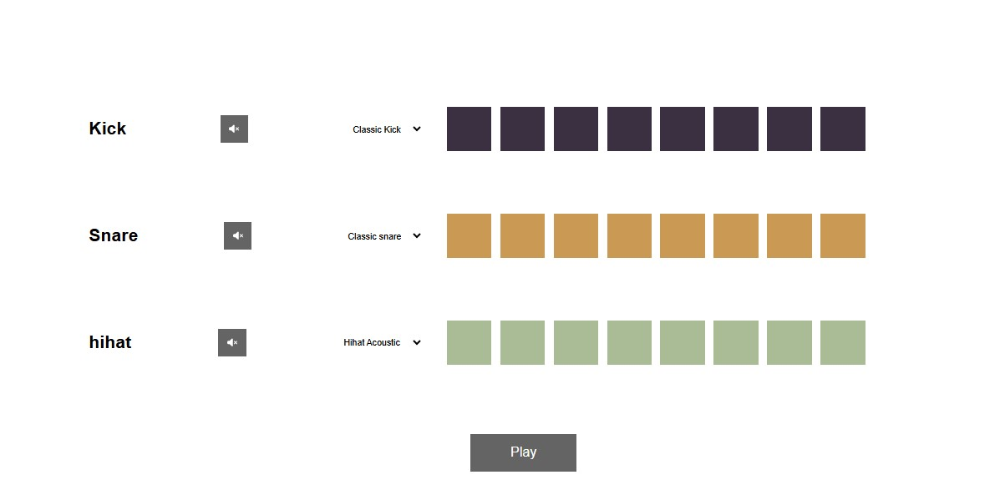

# 🎵 Beatmaker

**Beatmaker** is a fun and interactive web app that lets you create custom drum loops using a step sequencer. This project was developed as part of the course _"From Beginner JavaScript To Building Awesome Web Apps and Websites!"_ to practice JavaScript while exploring creative audio programming.

## 🚀 Features

- 🎛️ **Customizable Sound Selection** – Choose different Kick, Snare, and Hi-hat samples.
- 🎵 **Step Sequencer** – Click on pads to activate or deactivate beats.
- ⏳ **BPM Control** – Adjust playback speed for varied rhythms.
- 🔄 **Looping Playback** – Seamless beat looping for real-time composition.

## 🛠️ Technologies Used

- **HTML5** – Structure and layout.
- **CSS3** – Styling and animations.
- **JavaScript ** – Interactivity and audio playback.

## 📸 Preview



## 🔧 Installation & Usage

1. Clone the repository:
   ```bash
   git clone https://github.com/guithr/beatmaker.git
   ```
2. Open `index.html` in your browser.
3. Start making beats! 🎶
